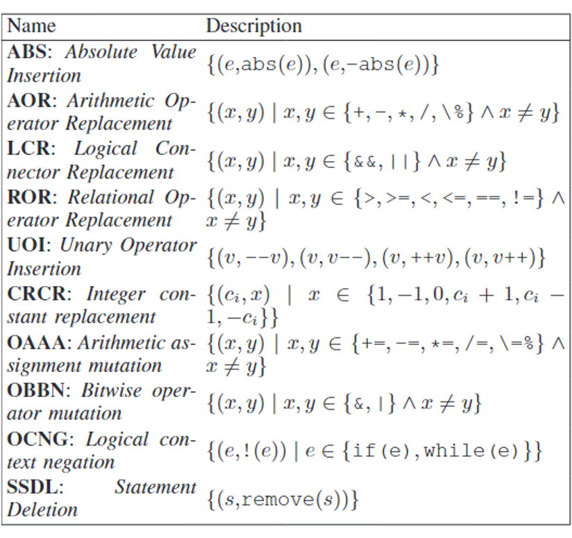
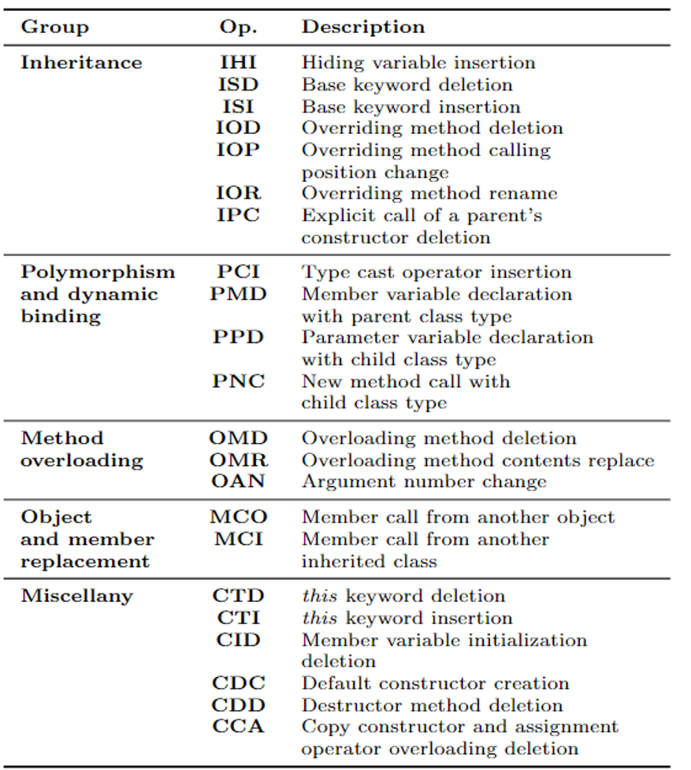
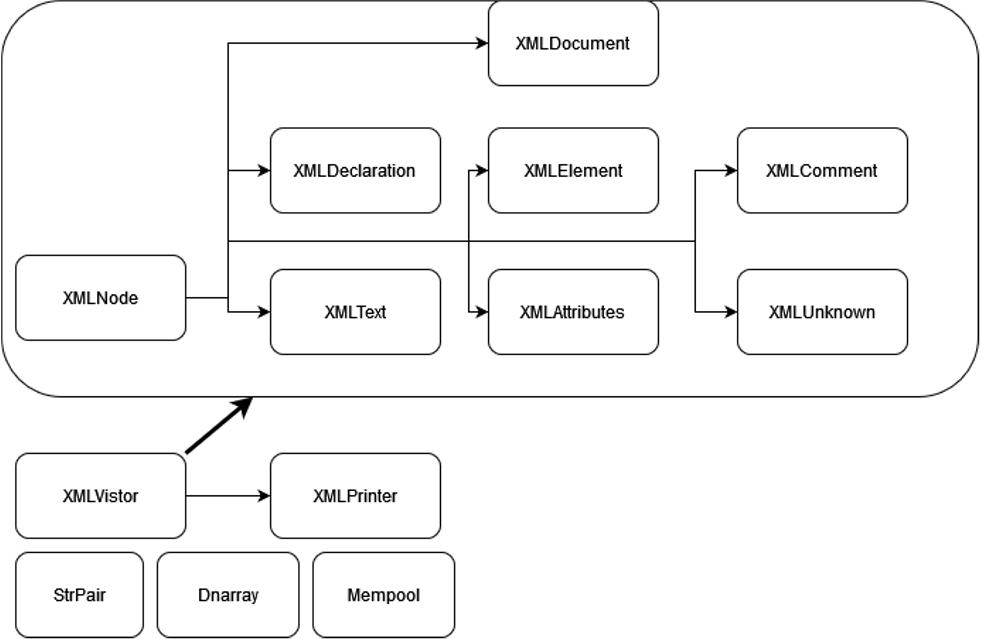
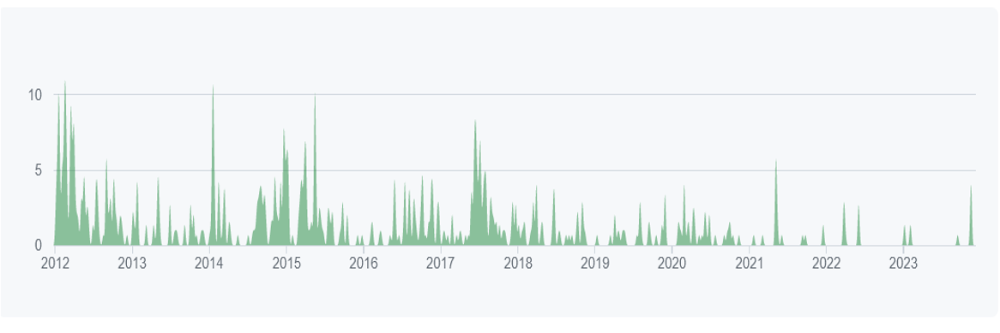
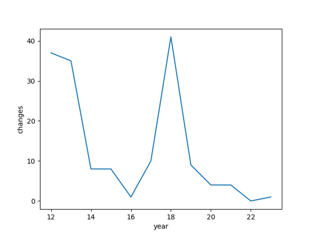

# C++程序中由变异算子产生的等价变异体的识别技术分析与改进
> 计算机学院 罗运泽 张明韬
## 背景
+ 变异算子常被应用于测试用例覆盖率检测、软件错误模拟等应用
+ 面对C++程序当中，面向对象的变异算子产生的一阶等价变异体的识别
+ 主要基于的技术：TCE(Trivial Compiler Equivalence)优化
+ 以C++中特有的面向对象变异算子为主要对象，探讨其相关研究与识别技术
+ 主要使用的参考文献：
    > Study of Trivial Compiler Equivalence on C++ Object-Oriented Mutation Operators
    + 探讨了在C++程序中TCE对等价变异体的识别情况，但仅对大量程序项目进行了TCE判断过程
    > Assessment of class mutation operators for C++ with the MuCPP mutation system
    + 执行C++程序上的变异测试，并对变异算子进行评估，但忽略了等价变异体可能带来的影响
## 目标
1. 对现有TCE技术进行研究分析，并对于变异算子进行分类，观察不可被TCE识别的等价变异体，对比源程序与变异体的编译结果，分析其效率
2. 根据上述结果，对TCE技术的不足之处进行统计分析，并使用规则/大模型对TCE技术进行补充与改进
## 变异算子
+ 现有技术中的变异算子主要分为传统变异算子与面向对象变异算子两类。
+ 传统变异算子：

+ 面向对象变异算子：

## RQs
+ 针对变异测试的实践、分析与优化（C++）
+ **RQ0**：对选定项目代码、流行程度、更新情况、Issues情况进行分析（**查看当前测试代码的测试情况**）
+ **RQ1**：分析其等价变异体数量，利用TCE技术分析可被编译器识别的部分，利用人工手段标注该项目的所有等价变异体，统计分析不可被编译器识别部分的常见形式（**统计分类不可被TCE识别的等价变异体**）
+ **RQ2**：对比大模型局部代码识别、TCE、TCE+规则、组合变换等技术（**根据统计对当前TCE方法进行补充改进**）
### RQ0：代码背景与分析
+ 我们首先选取了c++等价变异体识别相关论文中共用的TinyXML2项目进行分析
+ TinyXML2是一个轻量级、高效的XML解析软件，包括三个主要的代码文件：
    + tinyxml2.h: 完成相关类的定义，3032行
    + tinyxml2.cpp: 完成成员函数的实现，2388行
    + xmltest.cpp: 对现有代码进行测试，2744行
+ 软件声称对于TinyXML的功能进行了重写，实现了更高效的文件解析与读写过程，网络上搜索到的TinyXML为非开源软件，整体上看目前TinyXML2更为流行

+ 从其git仓库中可得到一定的软件更新信息，其目前共有93个open issues，和400个closed issues，其中，open的情况中有56个（60%）提出的问题有回应，共有112个contributors，今年共进行commit14次
+ 下图为项目在GitHub上的更新、修复，其中原作者更新主要出现在前期，后续15-18年左右的高峰期来自另一位contributor
+ 对于此类功能固定、无模块填充的软件，其更新、测试随着提出频率逐渐下降，当前代码最新更新来自3周前，而最近使用的测试代码仍为7个月前，我们人工统计了测试代码的变化情况

### RQ1：变异体标注、分析与分类
#### 变异体分类
+ 对于当下共6个变异算子，共745个变异体当中进行标注、判断与统计

| 变异算子 | 描述 | 变异体总数 |
| :---: | :---: | :---: |
| MCO | 将XML的name和value互换，或将DOM树上节点交换调用 | 25 |
| OMD | 将子类对父类的重载方法删去 | 85 | 
| CCA | 将复制构造函数的重载删除 | 4 |
| CDD | 将析构函数删去，会造成函数内空间的区别 | 7 |
| PCI | 将各类子类的对象进行类型转换至其他的子类 | 565 |
| CID | 将成员变量的初始化删去，非0的未初始化可能对代码产生影响 | 59 |

#### 统计结果
+ 由于汇编代码（更严格的要求为机器码）一致的程序必然为等价变异体，因此TCE方法对等价变异体的判断不会犯第一类错误，不会产生假阳性样本，也就是将非等价变异体识别为等价变异体。
+ 因此，TCE方法的特异度固定为100%，考虑分析其灵敏度。
+ 此外，由于某些变异体存在*合法输入结果一致，非法输入结果可能不一致*的情况，因此将其单独归类，记为*弱等价变异体*。有一部分变异体无法通过编译，易于识别，记为*平凡的非等价变异体*。

| **变异测试结果统计** | MCO | OMD | CCA | CDD | PCI | CID | 总计 |
| :-: | :-: | :-: | :-: | :-: | :-: | :-: | :-: |
| 平凡的非等价变异体 | 0 |29|0|0|268|0|297|
|判定的等价变异体|0|19|4|0|42|18|83|
|未判定的非等价变异体|25|37|0|4|216|37|319|
|<font color="yellow">未判定的弱等价变异体</font>|0|0|0|3|31|4|38|
|<font color="yellow">未判定的等价变异体</font>|0|0|0|0|8|0|8|
|总计|25|85|4|7|565|59|745|

#### 灵敏度分析
+ 统计TCE技术的灵敏度。此处由于存在弱等价变异体的疑问，因此计算包括/不包括两种灵敏度。
+ 可以看到，对于不同的变异算子，TCE技术的表现迥然不同。
+ 对于OMD和CCA算子，TCE能够准确地找到等价变异体；而在PCI与CID上，由于类型转换与变量初始化的特殊性，有些等价变异体可能汇编代码与机器码并不相同，TCE无法识别，将在下一个RQ分析。

| **灵敏度分析** | MCO | OMD | CCA | CDD | PCI | CID | 总计 |
| :-: | :-: | :-: | :-: | :-: | :-: | :-: | :-: |
|真正的等价变异体|0|19|4|0|50|18|90|
|含弱等价变异体|0|19|4|3|81|22|129|
|判定的等价变异体|0|19|4|0|42|18|83|
|<font color="red">灵敏度</font>|-|100%|100%|-|84%|100%|92%|
|<font color="red">含弱灵敏度</font>|-|100%|100%|0%|52%|82%|64%|

#### 等价识别分析
+ 汇编语言可能会生成冗余信息，对TCE的判断进行干扰
+ 因此，为了保证TCE的性能，对其稍作加强，修改为机器码对比
+ 可以看到，OMD算子删去了对父类的重载方法，这可能会导致删除后的汇编代码变短。如果这些重载方法没有被调用，或者是重载的与父类的效果一致，则虽然汇编代码有区别，但机器码会删去冗余
+ 而对于CCA算子，若成员对象里不包含需要深拷贝的内容时，简单的复制构造函数与系统默认的复制构造函数可能效果一致。这种情况下，删去复制构造函数可能对程序无影响。
+ 而其他算子不存在上述的汇编代码不一致而机器码一致的现象。

| **等价识别分析** | MCO | OMD | CCA | CDD | PCI | CID | 总计 |
| :-: | :-: | :-: | :-: | :-: | :-: | :-: | :-: |
|机器码相同的的等价变异体|0|19|4|0|42|18|83|
|汇编代码相同的的等价变异体|0|0|0|0|42|18|83|
|<font color="red">比例</font>|-|0%|0%|-|100%|100%|72%|

### RQ2：对当前TCE方法进行补充改进

+ 首先，我们对TCE技术无法识别的等价变异体进行分类，然后利用规则与大模型对TCE技术进行改进。

#### 无法识别的等价变异体

+ 经过统计整理，我们发现目前TCE无法处理的等价变异体分为如下的几类：
1. 真值判断等价变异体
由于代码对真值判断的特殊性，大部分变量只要不为0值或是空值，就不会对真值判断的结果产生影响。这种等价变异体多存在于PCI中，由于类型转换不影响存储的值，因此程序表现等价。
```python
 	XMLNode* clone = this->ShallowClone(target);
-	if (!clone) return 0;
+	if (!/*PCI*/dynamic_cast<tinyxml2::XMLDocument*>(clone)) return 0;
```
2. 继承父类方法等价变异体
作为面向对象语言的重要特性，对父类函数的继承保证了子类具有某种共同的特征。若几个子类并未对父类的某一方法进行重载，则PCI中的子类之间的类型转换就不会对结果产生影响。
```python
     XMLUnknown* unk = CreateUnlinkedNode<XMLUnknown>( _commentPool );
-    unk->SetValue( str );
+    /*PCI*/dynamic_cast<tinyxml2::XMLNode*>(unk)->SetValue( str );
```
3. 地址等价变异体
对对象的类型转换不会改变地址。C++的编译器可能不能很好地处理这种情况，导致汇编代码与机器码不同，但是其实可能汇编代码执行的是相同的操作。
```python
 	TIXMLASSERT(target);
-    if (target == this) {
+    if (/*PCI*/dynamic_cast<tinyxml2::XMLNode*>(target) == this) {
         return; // technically success - a no-op.
```
```sass
< 	movq	-40(%rbp), %rax
< 	cmpq	%rax, -48(%rbp)
---
> 	movq	-48(%rbp), %rax
> 	cmpq	-40(%rbp), %rax
```

#### 无法识别的弱等价变异体
+ 目前TCE无法处理的弱等价变异体则分为如下的几类：
1. 初始化弱等价变异体
指针类变量存在需要初始化的问题。但是若程序中的初始化是非法值（如0），则合法的操作输入将需要将指针赋为有意义的值，从而使CID算子删去初始化流程变得等价。而若非法输入没有赋值，则程序表现可能会产生差异。
```python
-    XMLAttribute() : _name(), _value(),_parseLineNum( 0 ), _next( 0 ), _memPool( 0 ) {} # _memPool is a pointer
+    XMLAttribute() : _name(), _value(),_parseLineNum( 0 ), _next( 0 ) /*CID*/ {}
```
2. 内存空间弱等价变异体
见于PCI算子中，在析构函数中进行类型转换后，若非法对对应的内存空间进行读取或操作的话，可能会导致输出不同，但若合法输入不影响内存，则程序表现无差异。
```python
-    DeleteNode( node );
+    DeleteNode( /*PCI*/dynamic_cast<tinyxml2::XMLDocument*>(node) );
```

#### 基于规则的改进
+ 对于三类易于判断的等价变异体，我们可以在源代码变异时，引入独特的基于规则的判断程序，在TCE判断之前就给出等价变异体的判断。
+ 同时，对于两类弱等价变异体，我们可以通过类型判断等方式进行判断，并输出独特的*弱等价变异体*的结果。而其他的弱等价变异体，其具体等价情况与类的定义强相关，因此无法做到普适性地对等价变异体进行判别。 
+ 可以看到，我们对TCE方法进行的补充改进提升了灵敏度。

| **灵敏度分析** | MCO | OMD | CCA | CDD | PCI | CID | 总计 |
| :-: | :-: | :-: | :-: | :-: | :-: | :-: | :-: |
|真正的等价变异体|0|19|4|0|50|18|90|
|含弱等价变异体|0|19|4|3|81|22|129|
|判定的等价变异体|0|19|4|0|50(57)|18(22)|83|
|<font color="red">灵敏度</font>|-|100%|100%|-|100%|100%|97%|
|<font color="red">含弱灵敏度</font>|-|100%|100%|0%|70%|100%|71%|

#### 基于大模型的改进
+ 为了实验的丰富性，我们在最后进行了使用大模型进行简单的能力评估
+ 直接使用上下文对代码进行判断
    + tinyxml2代码总共长达4w个token，远大于ChatGPT能提供的4K范围，此外，利用分块上传的方法无法识别一阶变异体的微小变动
    + 这显著地说明了LLM对于代码，尤其是大型工程分析能力的限制
+ 使用大模型微调完成代码的注入
    + tinyxml2于2012年提出，较为流行，对ChatGPT提问可以得到其百科介绍以及部分代码
    + 利用ChatGPT进行判断，模拟大模型在微调过后是否拥有识别等价变异体的能力
    + 在判断过程中大模型倾向于认为代码发生了变化，但仍然能够识别出部分变异体的等价性
    + 对于代码进行手动拆解能够提高其对代码的理解能力
    + 弱等价变异体是变异测试中需要额外注意的部分，但TCE与LLM对其识别能力都不佳
    + 下表展示了结果，每格分别为TCE未识别出的，而对应模型识别出的非等价/弱等价/等价变异体数量。

| **大模型结果分析** | MCO | OMD | CCA | CDD | PCI | CID |
| :-: | :-: | :-: | :-: | :-: | :-: | :-: |
| ChatGPT + code | 20/0/0 | 20/0/0 | - | 4/0/0 | 20/0/0 | 20/0/0 |
| ChatGPT + crafted code | 20/0/<font color="red">1</font> | 20/0/0 | - | 4/0/0 | 20/0/0 | 20/0/0 |
| GPT-4 + code | 20/0/4 | 20/0/0 | - | 4/0/0 | 20/0/0 | 20/1/0 |
| GPT-4 + crafted code | 20/0/<font color="red">6</font> | 20/0/0 | - | 4/0/0 | 20/0/0 | 20/<font color="red">3</font>/0 |
| 实际数量 | 20/0/0 | 20/0/0 | - | 4/3/0 | 20/20/8 | 20/4/0 |

## 结论
+ 在当前任务中，TCE有着比预想更好的性能

+ 弱等价变异体可能由多种情况导致，其识别相对等价变异体更加复杂

+ 对于当下的实验数据集，采用TCE、规则与大模型的方法都可以对等价变异体进行较好的识别，但是对于弱等价变异体往往需要更多人类观察与推理
